# Stratside, the Puzzle Defense Game where you Save Planets from a Side-Scrolling Gravity-Changing Enemy!

## Forget the Hordes of Dummy Enemies of Traditional Tower Defense Games, and Get Ready to Challenge a Single Enemy Mastermind – Better Quality than Quantity!

Stratside is a space-themed Puzzle Defense game, where the player needs to strategically place a set of gadgets with brain-twisting attack patterns to defeat a maniac enemy robot, before he presses a planet-destroying red button!

In traditional defense games, e.g. in tower defense titles, there are dozens of not-very-smart enemies that quickly appear in hordes and follow predictable paths towards a goal. Unlike those, Stratside presents a single, yet very powerful enemy mastermind, capable of running and jumping following a side-scrolling movement scheme, but also able to change the direction of gravity. This intelligent enemy is capable of finding the best (safest and fastest) possible path, thanks to a Deterministic Physics Artificial Intelligence System developed specifically for the game, which was integrated to work efficiently with Unreal Engine 4, used to develop the game.

Since only a perfect placement of gadgets can lead to beating the enemy in a level, the player has all the time in the world to prepare and update placements, and he/she can also preview the path of the enemy, who is invoked only when the player is ready.

The game includes more than 100 levels, with an expected playtime  greater than 10 hours, plus the time that the player decides to spend creating his/her own levels, and trying out the levels created by other members of the Stratside's community. A level editor has been implemented to make this possible, along with a level manager system, that allows to organize custom levels in level sets.

## Steam Page

[Check out the Steam page here! You can get the game if you like it!](https://store.steampowered.com/app/604990/Stratside/)

## Gameplay Trailer

[Check out the Launch Gameplay Trailer in Youtube here!](https://www.youtube.com/watch?v=nSwHXmbfuuE)

[Check out the Gameplay Trailer in Youtube here!](https://www.youtube.com/watch?v=XRAxAK_yOGk)

## Image Gallery

These are some images of the game (but you can find more in the Steam page):

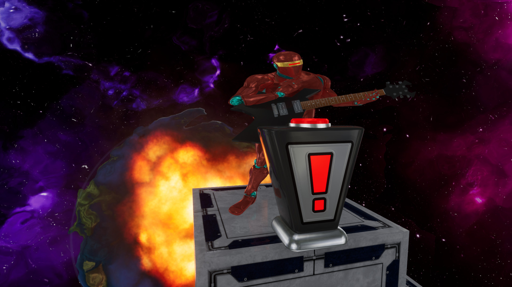
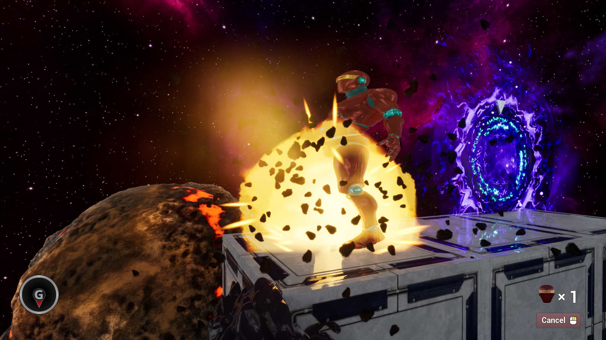
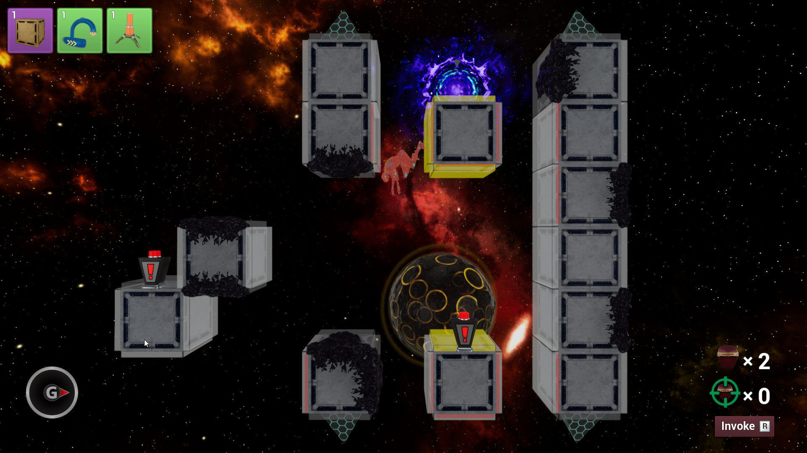
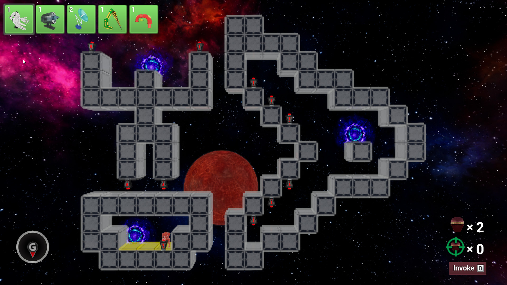
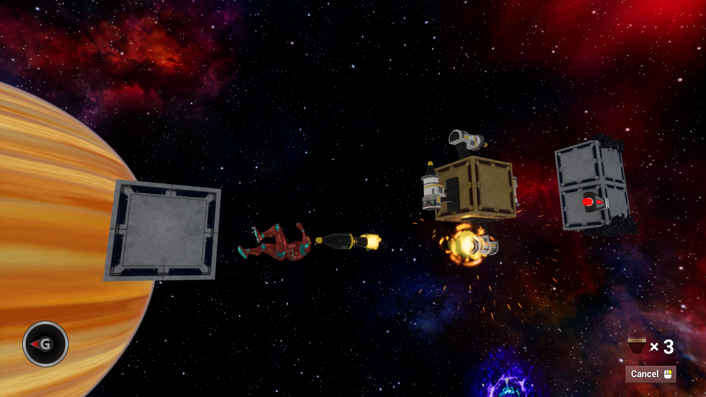
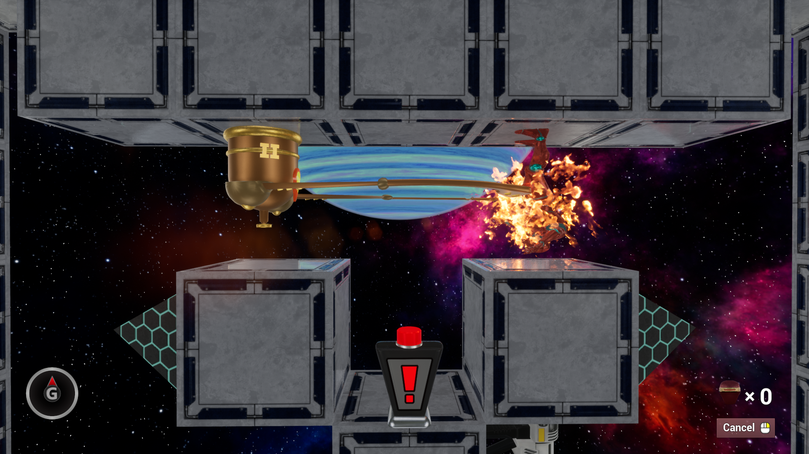
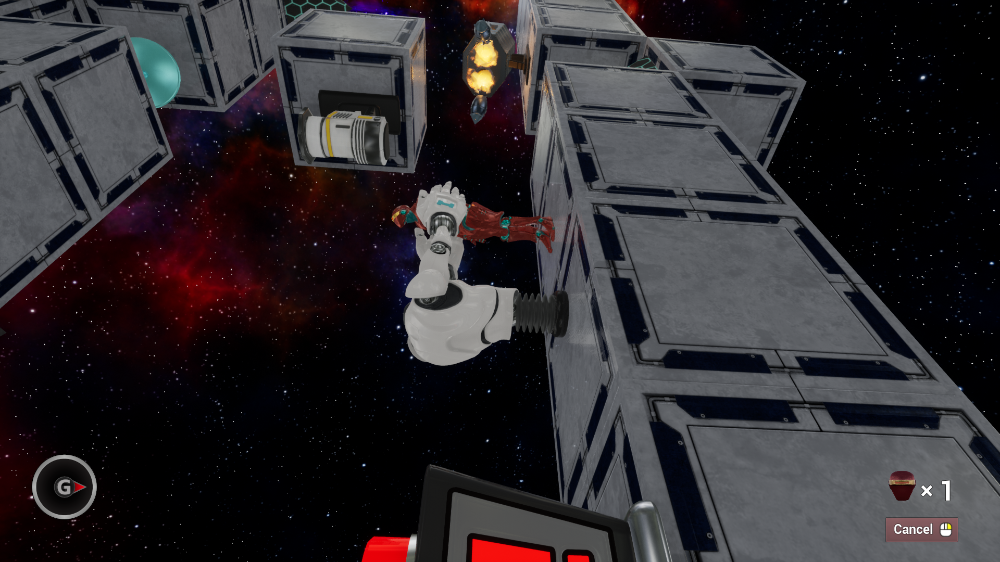
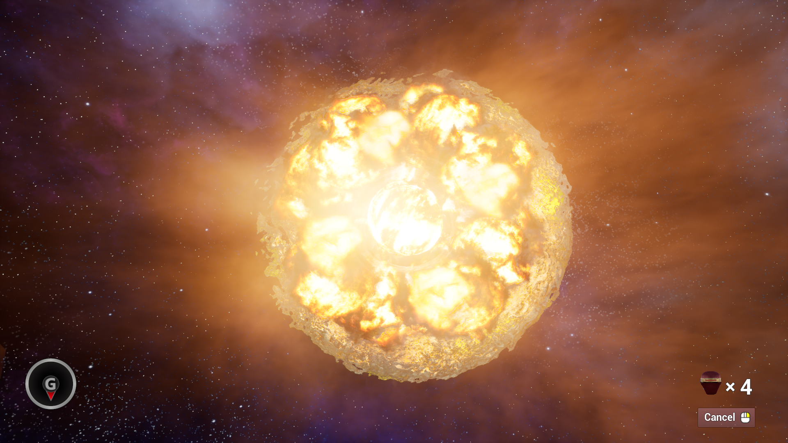
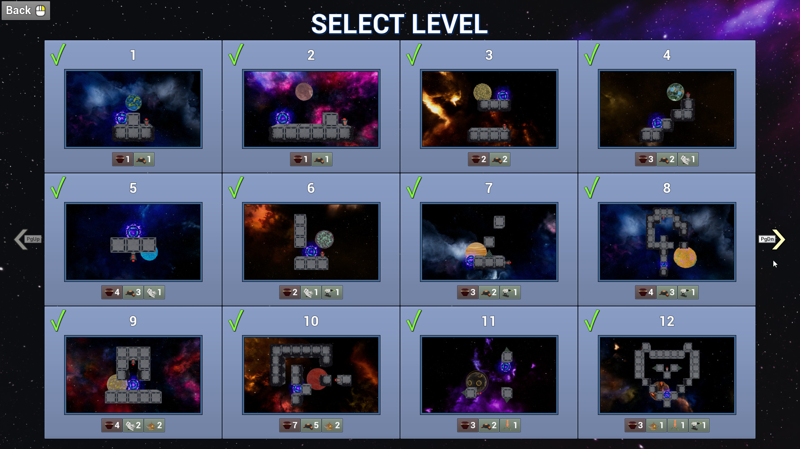
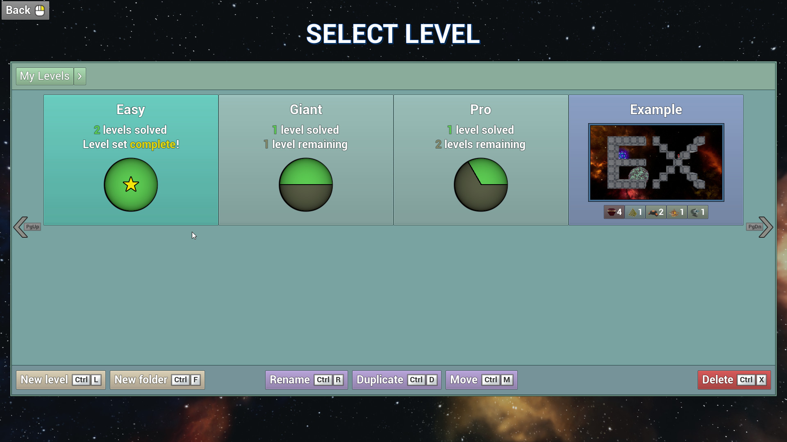
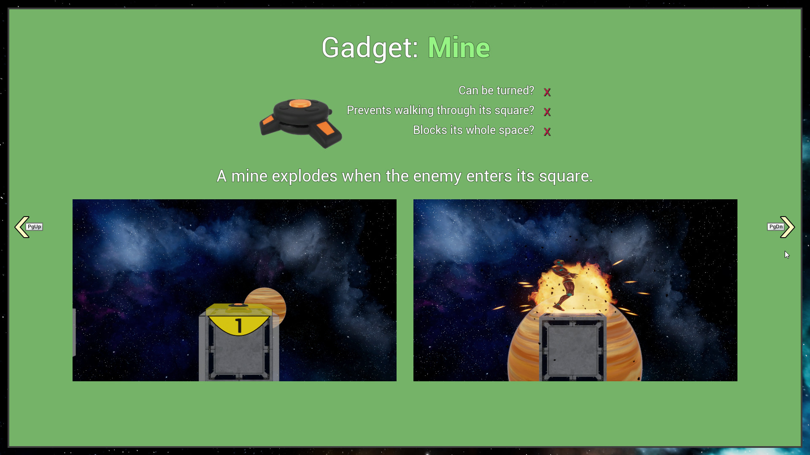
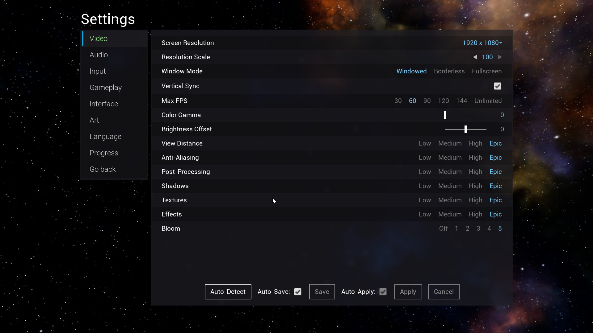
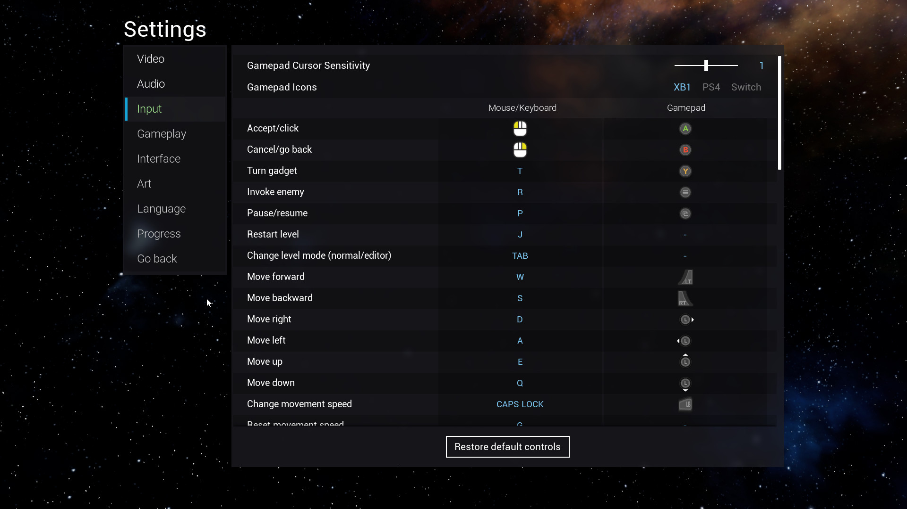
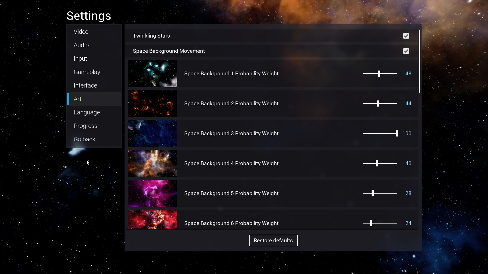

## Other Information

Stratside is a game developed by Albert Espín. All rights reserved. However, feel free to share the images, videos and links of the game if you want, but please mention that they are from Stratside (with a link to the Steam page or this GitHub repository), and do not share modified versions if have lesser quality.

